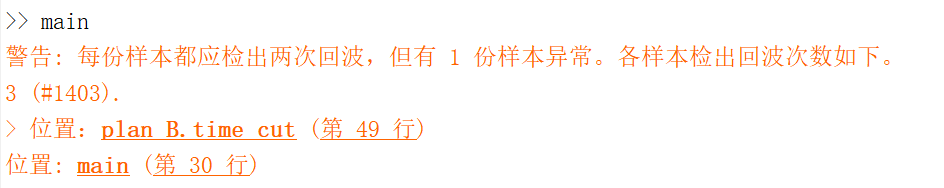

# Attenuation estimation & Part sentencing

## 记录

### 峰值检测

<figure>
    
    <figcaption>峰值检测</figcaption>
</figure>
如上图，正常检测出峰值，两次回波都在相应范围内。

峰值检测需提取两次峰值，基于 Plan B 的`time_cut`。下图随机取了若干点，展示`time_cut`的切分情况，加以验证。上半图展示了这些样本滤波去噪后的时域波形（的绝对值），以及相应 20% 阈值；下半图展示了`time_cut`的切分情况，1 的部分判定为回波。

<figure>
    
    <figcaption>随机若干点的判决情况</figcaption>
</figure>

> 图中编号`#slice`是`(#x, #y, #plate)`的线性维度。具体来说，若从零计数，则 x = `#x` × 1mm，y = `#y` × 1mm 处，在X板上是`#x + #y * 40`，在Y板上再加`40 * 20`。
>
> 上图中，#1512、#932、#993（蓝、紫、绿）属于Y，#743、#309（红、黄）属于 X。同一块回波的时间相近，不同板则不一定相近。

微调四五次参数后，几乎所有样本都像上面正确识别出两次回波。（即使不调整，40 × 20 × 2 = 1600 个样本中也只有 8 个未能正确切分。）



唯一的例外是 #1403，如下图，突发噪声太强，错误检出三次回波。虽然 #1403 的突发噪声仍比其两次回波时间短、幅度小，弱于 #1403 的回波，但它比其它某些地方的回波还弱，所以不宜改动`time_cut`的参数。在`get_peaks`中，我只考虑第一段和最后一段，跳过了 #1403 的突发噪声，勉强实现。

<figure>
    
    <figcaption>#1403 的判决情况</figcaption>
</figure>

### 最终评估

<figure>
    
    <figcaption>衰减图像</figcaption>
</figure>

<figure>
    <div style='display: grid; grid-template-columns: repeat(2, auto); gap: 1em;'>
        
        
    </div>
    <figcaption>衰减分布</figcaption>
</figure>

```matlab
>> main
          均值       标准差  
         _______    ________

    X    0.49895     0.04186
    Y     0.4468    0.068997
```

## References

- [Can Matlab's arguments function handle structs - MATLAB Answers - MATLAB Central](https://ww2.mathworks.cn/matlabcentral/answers/520619-can-matlab-s-arguments-function-handle-structs)
- [Understand Python Function Arguments - MATLAB & Simulink - MathWorks China](https://ww2.mathworks.cn/help/matlab/matlab_external/python-function-arguments.html)
- [创建常见的二维图 - MATLAB & Simulink Example - MathWorks 中国](https://ww2.mathworks.cn/help/releases/R2020b/matlab/creating_plots/creating-2-d-plots.html)
- [数据分布图 - MATLAB & Simulink - MathWorks 中国](https://ww2.mathworks.cn/help/releases/R2020b/matlab/pie-charts-bar-plots-and-histograms.html?s_tid=CRUX_lftnav)
- [How do I display a Table on Command Window? - MATLAB Answers - MATLAB Central](https://ww2.mathworks.cn/matlabcentral/answers/501363-how-do-i-display-a-table-on-command-window)
