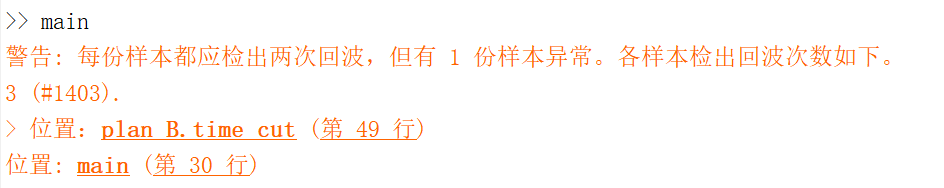

# Non-Destructive Identification of Mechanically Stronger Composite Plates

$$
\def\sinc{\operatorname{sinc}}
\newcommand\SI[2]{#1\ \mathrm{#2}}  % siunitx (package)
$$

## 简介

今有两薄板，欲探其强度。

以高强度超声波照之，板的两面都会反射回波。若板不够结实（致密），后面的回波会比前面的弱很多。检测两次回波间的衰减，就可了解板的强度。（衰减越轻越好）

- 板：碳纤维复合材料。长 40 mm、宽 20 mm、厚 3 mm。两块板，依次叫X、Y。
- 传感器数据：板上各个位置的波形。空间分辨率为 1 mm，时间采样率为 100 MHz。

本项目运用“数字信号处理”知识，分析这些数据，判断哪块板更好。

## 1 Signal Analysis

### 背景知识

- **数字信号**

  超声波信号 $\eval{x}_t$ 连续，计算机难以处理，抽样（并量化）为数字信号 $\eval{x}_n$ 才方便。实际处理时 $t,n$ 范围必须有限，只能截断。

  一般信号频谱范围有限，低采样率会导致高低频率歧义，采样定理限制了采样率的下限。

- **DFT**

  离散 Fourier 变换（discrete Fourier transform，DFT）及其逆如下。
  $$
  \begin{aligned}
  \eval{X}_k &= \sum_{n=0}^{N-1} \eval{x}_n W^{nk}. \\
  \eval{x}_n &= \frac{1}{N} \sum_{k=0}^{N-1} \eval{X}_k W^{-kn}. \\
  \end{aligned}
  $$
  其中 $N$ 是信号长度（或者说周期），$W = \exp(-2\pi j/N)$。

- **FFT**

  按定义计算 DFT 需 $\order{N^2}$ 次复数乘法，较复杂。存在快速 Fourier 变换（fast FT，FFT），只需 $\order{N \log N}$，提高了计算机处理数字信号的能力。

  FFT 利用 ${W_N}^{nk}$ 的对称性合并首尾项，利用其周期性、对称性、可约性将长序列 DFT 分解为多个短序列 DFT。

  就映射关系而言，FFT 与 DFT 完全等价——它们只是计算过程不同。本项目不关心 FFT 的具体实现，故不再介绍。

- **DFT 逼近连续信号**

  用 DFT 计算出的 $\eval{X}_k$ 可以逼近连续信号的频谱密度 $\eval{X}_{\Omega}$。
  $$
  \Omega
  = \frac{\omega}{T_\text{sample}}
  = \frac{k \frac{2\pi}{N}}{T_\text{sample}}.
  $$
  其中 $\Omega$ 是模拟频率，$\omega$ 是数字频率，$T_\text{sample}$ 是采样周期。

  然而数字信号、DFT毕竟不是原本连续信号、FT（Fourier transform），存在以下问题。

  |     问题     | 原因                                               | 改善方法                              |
  | :----------: | :------------------------------------------------- | :------------------------------------ |
  | **频域混叠** | 时域（周期）取样<br>频域周期化                     | 加紧采样，提高折叠频率                |
  | **栅栏效应** | 频域（周期）取样（只取基频整倍）<br>时域周期化     | 在时域补零凑数                        |
  | **频谱泄露** | 时域截断<br>频域每个横向滤波器的响应太宽，副瓣太强 | 乘缓变（taper）窗，减弱截断处的不连续 |

  在时域补零时窗函数宽度仍应按数据实际长度选取，并且只能提高频谱分辨率，增加总采样时长才能提高频率分辨能力。

  本项目和上面不太一样。

  |     问题     | 本项目情况                                   | 结果                           |
  | :----------: | :------------------------------------------- | ------------------------------ |
  | **频域混叠** | 采样率很高，回波频率远低于折叠频率           | 问题可忽略                     |
  | **栅栏效应** | 回波呈脉冲状，数据中有大段空白，天生就补零了 | 问题可忽略                     |
  | **频谱泄露** | 回波并不持续，不等人为截断自己就结束了       | 信号自身频谱就宽，二次截断无效 |

  这些特点后面也能实际观察到。

### a 读取数据

#### 原理和结果

为了方便之后向量化，我们把两块板的数据统一存到一个变量`data`里。这个张量有如下四个维度。

|   维度   |   意义   | 点数 |       采样间隔        |  记录长度  |
| :------: | :------: | :--: | :-------------------: | :--------: |
|   `#x`   | 空间之一 |  40  |         1 mm          |   40 mm    |
|   `#y`   | 空间之二 |  20  |         1 mm          |   20 mm    |
| `#time`  |   时间   | 905  | 1 / 100 MHz = 0.01 μs |  9.05 μs   |
| `#plate` |  哪块板  |  2   |      （不适用）       | （不适用） |

> 信号是 $\R^2 \cross \R \cross \R \to \R$，上表只介绍了自变量——因变量因信息不足，我并不确定是什么（大约是空气密度），因此下面所有文字、图中，因变量都不标单位。

#### 实现`+util/load_data.m`

实际代码如下。注释已涵盖在正文，以后不再重复，读者您可阅读附件中源代码或用`help <我的函数名>`查看。（例如在`src/`中`help util.load_data`）

```matlab
function data = load_data()
%load_data - 读取数据
%
% data = load_data()
%
% 输出：
% - data(#x, #y, #time, #plate)：所有板的数据

data = cat( ...
4, ...
    load("../data/CompositeX.mat").CompositeX, ...
    load("../data/CompositeY.mat").CompositeY ...
);

end
```

这个函数无需输入；后面还有需要输入的，例如`util.plot_time`，如下。函数体开头的 arguments 块验证数据类型，不影响程序逻辑，所以我们下面也都省略。

```matlab
function plot_time(data, LineSpec, options)
%plot_time - 以时间为横轴 plot
%
% plot_time(data)
%
% 输入：
% - data(#time, #plate)：所有板要画的一维数据
% - LineSpec：`plot`的`LineSpec`
%
% 选项：
% - SamplingRate：采样率，Hz，默认 100 MHz
% - PlateNames：板的名字，默认 X、Y。

arguments
    data(:, :)
    LineSpec = "-"
    options.SamplingRate (1, 1) {mustBePositive} = 100e6
    options.PlateNames (1, :) string = ["X" "Y"]
end

n_plate = size(data, 2);
n_time = size(data, 1);

if length(options.PlateNames) ~= n_plate
    warning("有 %d 块板，却提供了 %d 个名字。", n_plate, length(options.PlateNames));
end

t_us = (1:n_time) / options.SamplingRate * 1e6;

plot(t_us, data, LineSpec);
xlabel("$t$ / $\mu$s", "Interpreter", "latex");
legend(options.PlateNames);
grid('on');

end
```

### b 提取典型信号

每块板的数据有两维空间、一维时间，我们重点研究随时间的变化关系，基本独立分析各个空间位置点。

为此需提取典型信号，作为模型来初步分析。

#### 检查典型性：原理和实现`+signal_analysis/check_typicality.m`

选哪里作典型？这是个问题。需简单统计一下。

遍历所有板（`for p = 1:n_plate`）。

```matlab
n_plate = size(data, 4);
assert(length(options.PlateNames) == n_plate);
n_time = size(data, 3);

% ……

for p = 1:n_plate
    % ……
end
```

- **数据整体样貌**
  
  每块板数据的自变量、因变量共 4 维，难以画图直观理解。若将两维空间合并成一维，可画三维图。

  > 合并空间维度：`(#x, #y)` ↦ `#x + #y * 40`，其中 40 是`#x`这一维的点数。
  >
  > ```matlab
  > reshape(data(:, :, :, p), [], n_time)
  > ```
  
  画图代码比较繁琐，意义不大，后面不再罗列，请直接参考附件源代码。
  
  使用`mesh`绘图。为正确标注 $t$，需制备网格。
  
  ```matlab
  t = (1:n_time) / options.SamplingRate;
  xy = 1:size(data, 1) * size(data, 2);
  [t_mesh, xy_mesh] = meshgrid(t, xy);
  ```
  
  然后就能画图了。
  
  ```matlab
  % 准备 figure
  f_all = figure("WindowState", "maximized");
  subplot(n_plate, 1, 1);
  
  for p = 1:n_plate
      % ……（画其它的图）……
  
      % 切换 figure
      figure(f_all);
  
      subplot(n_plate, 1, p);
      mesh(xy_mesh, t_mesh, reshape(data(:, :, :, p), [], n_time));
      xlabel("空间取样点序号");
      ylabel("$t$ / s", "Interpreter", "latex");
      title(options.PlateNames(p));
  end
  ```
  
- **定量计算**

  之所以“定量计算”，是因为分析了“数据整体样貌”，详见后文。
  
  ```matlab
  fprintf("%d. plate #%d\n", p, p);
  
  spatial_std = squeeze(std(data(:, :, :, p), 0, [1 2]));
  all_std = std(data, 0, 'all');
  
  %% Print
  fprintf("  - 数据的整体的标准差是 %.2f。（所有帧、所有位置）\n", all_std);
  fprintf("  - 而同一帧中，（不同位置）数据的标准差平均只有 %.2f，占 %.1f%%。\n", ...
      mean(spatial_std), mean(spatial_std) / all_std * 100);
  ```

#### 检查典型性：结果及分析

将两维空间合并成一维，得到下图。

<figure>
    
    <figcaption>数据整体样貌</figcaption>
</figure>

- 在绝大部分空间位置点，数据都明显包含两次回波，并且这些回波的时间范围几乎一致。
- 不同地方回波的幅度参差不齐，相位看不太清，可能也不完全相同。

于是**<u>猜想：不同地方的数据基本同步变化</u>**，大家都挺典型。

定量计算检验如下。

```matlab
>>> main_typical
1. plate #1
  - 数据的整体的标准差是 10.21。（所有帧、所有位置）
  - 而同一帧中，（不同位置）数据的标准差平均只有 5.47，占 53.6%。
2. plate #2
  - 数据的整体的标准差是 10.21。（所有帧、所有位置）
  - 而同一帧中，（不同位置）数据的标准差平均只有 5.78，占 56.6%。
```

<figure>
    
    <figcaption>空间标准差随时间的变化</figcaption>
</figure>

- 空间标准差占比大约一半。

  如果数据完全没有同步变化趋势，占比应接近 100%。

- 空间标准差随时间显著变化。数据本身幅度越大的时刻，空间标准差大致也越大。

  如果数据完全同步变化，不同位置的差异全由板子引起，那么空间标准差应几乎恒定。

所以，不同地方回波**<u>确实有同步变化趋势</u>**，但**<u>只是趋势</u>**，相位等有不小差异。仍可认为**<u>大部分空间位置点都挺典型</u>**。

#### 提取典型信号`+signal_analysis/extract_the_typical.m`

##### 实现

- **输入**`data(#x, #y, #time, #plate)`：所有板的数据。
- **选项**
  - Method：取样方法。
    - center：取中心（默认）
    - mean：取空间的算术平均
    - random：随机取一点，所有板都取同一位置
- **输出**`s(#time, #plate)`：所有板的典型信号。

```matlab
if options.Method == "mean"
    s = mean(data, [1 2]);
else

    if options.Method == "center"
        xy = round(size(data, [1 2]) / 2);
    else
        xy = [randi(size(data, 1)) randi(size(data, 2))];
    end

    s = data(xy(1), xy(2), :, :);
end

s = squeeze(s);
```

##### 单元测试

我采用基于脚本的测试框架。例如`extract_the_typical_test.m`测试`extract_the_typical`，如下。

```matlab
import signal_analysis.extract_the_typical

data = rand(4, 3, 5, 2);

%% Shapes
for m = ["mean" "center", "random"]
    assert(isequal( ...
        size(extract_the_typical(data, "Method", m)), ...
        [5 2] ...
    ));
end
```

它帮助事前设计结构、事后验证功能。例如我最初没写`s = squeeze(s)`，若没有上面这测试，我很难一开始就发现，让`(1, 1, #time, #plate)`型张量影响后面分析、画图。

由于测试不影响程序逻辑，后面也不再一一列出。

### c 时域分析

<figure>
    <div style='display: grid; grid-template-columns: 3fr 2fr; gap: 1em;'>
        
        
    </div>
    <figcaption>时域典型信号（center）<br>右图是左图的局部放大。</figcaption>
</figure>

- 无论是哪块板，都存在**两次明显回波**，**峰值**为 50–100。

  两次回波分别来自板的前面、后面，符合预期。

- 两块板**回波的位置**不同，X 大约在 3 μs、5 μs，Y 大约在 2 μs、4 μs。两次回波的间隔相近，约 2 μs。

  回波时间差 = 2 × 板厚 / 波速，板厚都是 3 mm，波速也与板无关，故两块板的回波时间差应当一样，符合预期。

  这样反推出的波速是 3 km/s 上下。不过老师的文档只说是碳纤维复合板，不知具体为何材料，但一般金属中声速是 6 km/s，水中是 1.5 km/s，数量级大差不差。

- 无论是哪块板、哪次回波，**回波**基本都只**持续**一两个周期（约 0.3 μs），就淹没在噪声中了。

- 由局部放大图，**回波的周期**约为 0.15 μs，对应频率 7 MHz，确实是超声波，而且 100 MHz 足够采样。

- **噪声**幅度基本不随时间变化，峰值大约为 10。

<figure>
    <div style='display: grid; grid-template-columns: repeat(2, auto); gap: 1em;'>
        
        
    </div>
    <figcaption>时域典型信号（其它取样方法）<br>左：random；右：mean。</figcaption>
</figure>

以上是取板的中心作为典型信号，我还看了下其它取样方法，如上图。

- 左边 random 是随机取别的点，特征和前面 center 相同。

- 右边 mean 是取每帧的空间算术平均，回波、噪声的幅度都变小了，噪声变小得更多，而且不同时刻的相对幅度几乎不变。噪声被抑制后，能看到更长时间的回波。

  回波来自板的整体振动，由前面“检查典型性”分析，不同位置相位不完全一致，空间平均会削弱振幅。噪声来自空气、仪器，不同位置没太大关联，空间平均削弱得更多。无论是哪种情况，这种削弱都是整体缩小，与时间无关。——这些现象都可以解释。

  另外，X 在 7 μs 附近还有个小峰，不过峰值没超过抑制前的噪声峰值（10），很可能是噪声累积而成的巧合。

center 有整体变形，random 结果难以复现，故后面还是采用 center。

### d 频域分析

<figure style='break-inside: avoid-page;'>
    <div style='display: grid; grid-template-columns: 3fr 2fr; gap: 1em;'>
        
        
    </div>
    <figcaption>典型信号（center）的幅度谱<br>右图是左图的局部放大。</figcaption>
</figure>

- 时域按 100 MHz 抽样，频域则以 100 MHz 周期化；时域截断在第 905 点，DFT周期化导致频域离散为 905 个点，频谱分辨率为 100 MHz / 905 ≈ 0.1 MHz。上图横轴是模拟频率，由数字频率转换而来。

  根据下面对信号频谱的分析，频域 0.1 MHz 分辨率已足够，不必再在时域补零。

- 幅度谱严格偶对称[^even]，连毛刺都一模一样。（关于 0 MHz 或 50 MHz）

  因为是实信号，频谱共轭对称，故幅度谱偶对称，符合预期。

- **信号**集中在 3–8 MHz（及其对称位置），与时域分析出的 7 MHz 一致。

- X、Y 性态相似，包括信号和噪声。

- **信号**不是冲激，而是有约 5 MHz 的**宽度**，并且峰内部还有宽约 0.5 MHz 的小峰。

  先看包络宽度。时域分析出信号只持续 0.3 μs 左右，时域乘门函数相当于频域卷积 $\sinc$，按谱零点计，带宽 ≈ 2 / 0.3 μs ≈ 6 MHz，与幅度谱包络宽 5 MHz 一致。这时再仔细看频谱，原来主峰之外还能看到一两个副瓣。

  再看小峰宽度。由于频谱分辨率高达 0.1 MHz，0.5 MHz 的小峰并非幻觉，实际标出数据点观察也如此。回顾时域，信号有前后两次回波，相距 $\Delta t \approx \SI{2}{\mu s}$，频谱相位差导致干涉因子 $1 + e^{-j \omega \Delta t}$，体现在幅度谱就是 $\abs{1 + e^{-j\omega \Delta t}} = \abs{\cos(\frac{\omega \Delta t}{2})}$，零点间隔 $\Delta \omega = 2\pi / \Delta t$，即 $\Delta f = 1/\Delta t \approx \SI{0.5}{MHz}$，与小峰宽度一致。

- 噪声是**白噪声**，在所有频率的功率相近，大约为 100。

[^even]: 此处“对称”均指圆周对称。

### 小结

| 信号特征 |              数值              |
| -------: | :----------------------------: |
|     位置 | X: 3 μs, 5 μs<br>Y: 2 μs, 4 μs |
| 时间间隔 |              2 μs              |
| 持续时间 |             0.3 μs             |
|     幅度 |             50–100             |
|     频率 |             7 MHz              |

噪声所有时间、所有频率均匀分布，时域峰值大约为 10。

## 2 Noise Reduction

### 背景知识

- **滤波器**

  滤波器是一种线性时不变（linear time-invariant, LTI）系统。输出信号等于属于信号与其单位冲激响应的卷积。由于信号与噪声的频谱范围不同，设计适当的频率响应，可以抑制噪声。

- **FIR 滤波器**

  数字滤波器的单位冲激响应如果有限长，则称为 FIR（finite impulse response）滤波器。

  与 IIR（infinite impulse response）滤波器相比，FIR滤波器不存在稳定性问题，可用对称性保证相位线性，但满足相同幅度特性需要的阶数更多。

### a 滤波器特性

#### 设计

1. **选择类型**

   要求：

   - 本项目采集数据后统一处理，只关心板的强度，无需实时。
   - 考查强度后续需测量峰值。信号肯定不完全单频，一点点相位差都会影响峰值，对数据可靠性要求太高。因此最好群时延与频率无关。

   决策：采用能严格线性相位的 **<u>FIR</u>** 滤波器。它虽然阶数高，计算量大，时延大，但在本项目都不是问题。

2. **指标**

   <figure>
       
       <figcaption>典型信号的幅度谱<br>此为局部，完整图见前一节。</figcaption>
   </figure>

   - 信号集中在 3–8 MHz，希望保留这部分。
   - 数据有直流分量。如果数据代表空气密度，那么直流分量没有意义，还影响后续峰值测量，应当去除。
   - 低频、高频主要是噪声，可以去除。

   计划设计**<u>带通</u>**滤波器。通带范围 3–8 MHz，波纹尽可能小；阻带要求不高，有就可以，具体截止频率、衰减之后看情况确定。最后采用的指标如下。

   - 通带：3–8 MHz 内，波纹 1dB。
   - 阻带：2 MHz、15 MHz 以外，衰减高于 13 dB。

3. **设计方法**

   我本来想手动设计滤波器，采用频域取样法，但因为细节太多：过渡带设计、阶数导致的频率以及线性相位问题、……最终未能完成，只好采用`designfilt`自动设计。

   ```matlab
   reducer = designfilt( ...
       'bandpassfir', ...
       'SampleRate', 100, ...
       'StopbandFrequency1', 2, 'StopbandAttenuation1', 13, ...
       'PassbandFrequency1', 3, 'PassbandFrequency2', 8, 'PassbandRipple', 1, ...
       'StopbandFrequency2', 15, 'StopbandAttenuation2', 13, ...
       'DesignMethod', 'equiripple' ...
   );
   ```

   我采用等波纹设计方法，它允许带通滤波器（有些方法只支持低通、高通等），采用 Parks-McClellan 算法。这种滤波器的波纹相等：每次波纹几乎都取到极限要求，比如整个阻带频率响应的振荡几乎和频率无关，因为针对所有振荡中的最大的优化。

#### 结果及分析

符合以上要求的 FIR 带通滤波器有 71 阶。系数太多，就不在此列出了。

<figure>
    
    <figcaption>滤波器的频率响应<br>以上只是幅度响应；相位响应线性，不必画出。</figcaption>
</figure>

滤波器频率响应如上图。

- 橙色虚线是指标的边界，通带、阻带都在区间内，符合标准。（过渡带部分区域衰减超过要求，也符合指标。）
- 通带波纹、阻带振荡几乎取到边界，且分别相等，正是“等波纹”。

### b 去噪效果

<figure>
    
    <figcaption>滤波前后数据</figcaption>
</figure>


- 回波**信号**振幅、相对位置几乎不变。

  滤波器保留了回波信号的大部分频谱，应当不受影响。

- **噪声**幅度普遍减弱，剩余部分的频率与信号接近。

  噪声在信号以外的频谱受抑制，总功率降低；与信号频率接近的噪声几乎未处理，故主要剩余这部分。

- 整体存在明显**延时**，约 0.3 μs。

  FIR 滤波器线性相位，71 阶，群时延为 (71-1) / 2 / 100 MHz = 0.35 μs，与图象一致。

<figure>
    
    <figcaption>滤波前后数据的幅度谱</figcaption>
</figure>

- **直流分量**消失。

- **阻带**明显被抑制，但存在小波纹。波纹振幅基本与频率无关，周期约为 2 MHz。

  阻带基本是白噪声，频谱密度与频率无关。时域卷积相当于频域相乘，白噪声频谱与滤波器频率响应相乘，即为滤波后的频谱。

- **通带**基本不变，信号的频谱被断崖式截断。

  信号频谱范围原本很广，滤波器主要保留了 $\sinc$ 的主峰。

### c 滤波器截止频率和阶数的影响

随便改变通带截止频率和阶数看看，与之前不同的参数如下表。

| 序号 | 通带范围 | 阶数 | 阻带衰减 |
| ---: | :------: | :--: | :------: |
|    1 | 3–8 MHz  |  71  |  13 dB   |
|    2 | 3–8 MHz  |  88  |  20 dB   |
|    3 | 4–7 MHz  |  52  |  20 dB   |

<figure>
    
    <figcaption>滤波器的频率响应</figcaption>
</figure>

- 通带截止频率决定通带边界。
- 阻带振荡与阶数负相关，与通带宽度正相关。（阻带振荡与阻带衰减负相关）
- 通带越窄，通带内的振荡次数越少。

<figure>
    
    <figcaption>滤波后数据</figcaption>
</figure>

- 群时延和阶数正相关。
- 在这个范围内，各种参数组合在时域效果相近。

<figure>
    
    <figcaption>滤波后数据的幅度谱</figcaption>
</figure>

- 阻带衰减越多，阻带频谱密度越接近零。
- 通带越宽，保留的回波信号频谱越宽。

## 2.5 Plan B

由 Signal Analysis 背景知识中的分析，**信号在两域集中程度相近，时域略胜一筹**，我怀疑 Marking Scheme 规定时域卷积滤波去噪在此场景不太合适，于是做了些实验。用这套 Plan B 替代上面的 Noise Reduction，也能在下面的 Attenuation Estimation、Part Sentencing 得到类似结果。

Plan B 事实上早于 Noise Reduction 开发，其中的`freq_cut`辅助确定了 Noise Reduction 中的参数，`time_cut`会用于 Attenuation Estimation 检测峰值。

Plan B 毕竟不在 Marking Scheme 中，因此只附在正文之后。

## 3 Attenuation Estimation

### a 准备工作

之前只针对一个典型信号，现在要针对全部数据了。

1. **读取数据**

   按照 Signal Analysis 中的计划，我们重点研究随时间的变化关系，基本独立分析各个空间位置点。

   为此，我们将其余维度合并为`#slice`，后续去噪、提取峰值等操作只针对`#time`。

   ```matlab
   %% 读取数据
   data = util.load_data();
   
   n_x = size(data, 1);
   n_y = size(data, 2);
   n_time = size(data, 3);
   n_plate = size(data, 4);
   
   % (#x, #y, #time, #plate)
   % → (#time, #x, #y, #plate)
   data = permute(data, [3 1 2 4]);
   % → (#time, #slice)
   data = reshape(data, n_time, []);
   ```

   `#slice`是`(#x, #y, #plate)`的线性维度。具体来说，若从零计数，则 x = `#x` × 1mm，y = `#y` × 1mm 处，在X板上是`#x + #y * 40`，在Y板上再加`40 * 20`。后面的编号默认是`#slice`。

2. **Noise reduction**

   `data`备份为`raw_data`，滤波。

   ```matlab
   %% Noise reduction
   reducer = noise_reduction.prepare_reducer();
   raw_data = data;
   data = filter(reducer, raw_data);
   ```

### b 峰值检测

#### 原理和实现`+attenuation_estimation/get_peaks.m`

有两段回波，需要分别提取它们的峰值。

1. **切分信号与噪声**

   调用 Plan B 的`time_cut`，根据数据幅度和时间相邻关系切分信号与噪声。原理详见 Plan B 一节。

   <figure>
       
       <figcaption>时域切分结果示例</figcaption>
   </figure>

   ```matlab
   t = plan_B.time_cut(data, "DurationEstimated", 0.31e-6);
   ```

   其中 DurationEstimated 在 Signal Analysis 中估计为 0.3 μs，后续看情况手动调整至 0.31 μs。

   `t`的维度与`data`相同，也是`(#time, #slice)`；取值为每一点的类型判断结果，1表示信号，0表示噪声。

   实际这部分在函数`get_peaks`以外。

2. **确定每段回波的边界**

   给`t`在`#time`的首尾各补一零，尺寸增加到`n_time + 2`。

   > 如果不补零，一般也行，只有回波区间在开头或结尾时处理不好，但这种情况只有`time_cut`误判时存在。

   然后**差分**（`diff`），那么

   - 1 代表 0 → 1，即区间左端点`starts`。
   -  -1 代表 1 → 0，即区间右端点`ends`。

   > `diff`后尺寸缩回`n_time + 1`。
   >
   > 由于补零，首位要么 0 → 0 要么 0 → 1，故`diff`结果首位不可能为 -1，因此`ends`取值只有`n_time`种。`starts`同理。

   ```matlab
   t = diff(cat(1, zeros(1, n_slice), t, zeros(1, n_slice)));
   % …（其它部分）…
   
   for s = 1:n_slice
       starts = find(t(:, s) == 1);
       ends = find(t(:, s) == -1) - 1;
       
       % …（其它部分）…
   end
   ```

3. **记录每段的峰值**

   `peaks(#peak, #slice)`记录每个样本的第一段和最后一段峰值。

   正常来讲只有两段（板有两面嘛）。之所以写`1, end`而非`1, 2`，是为兼容 #1403，详见下。

   ```matlab
   % …（其它部分）…
   peaks = zeros(2, n_slice);
   
   for s = 1:n_slice
       % …（其它部分）…
   
       for p = 1:2
           if p == 1
               range_ = starts(1):ends(1);
           else
               range_ = starts(end):ends(end);
           end
   
           peaks(p, s) = max(abs(data(range_, s)));
       end
   end
   ```

#### 单元测试

`get_peaks`也做了单元测试`get_peaks_test.m`。峰值应当正负都算，我开始就忘了，测试才发现。

#### 结果及分析

<figure>
    
    <figcaption>典型信号的峰值检测</figcaption>
</figure>


X、Y典型信号检测结果如上图，正常检测出峰值，两次回波都在相应范围内。

峰值检测需提取两次峰值，基于 Plan B 的`time_cut`。下图随机取了若干点，展示`time_cut`的切分情况，加以验证。上半图展示了这些样本滤波去噪后的时域波形（的绝对值），以及`time_cut`相应 20% 阈值；下半图展示了`time_cut`的切分情况，1 的部分判定为回波。

<figure>
    
    <figcaption>随机若干点的判决情况</figcaption>
</figure>
> 上图中，#1512、#932、#993（蓝、紫、绿）属于Y，#743、#309（红、黄）属于 X。同一块回波的时间相近，不同板则不一定相近。

微调四五次参数后，几乎所有样本都像上面正确识别出两次回波。（即使不调整，40 × 20 × 2 = 1600 个样本中也只有 8 个未能正确切分。）



唯一的例外是 #1403，如下图，突发噪声太强，错误检出三次回波。虽然 #1403 的突发噪声仍比其两次回波时间短、幅度小，弱于 #1403 的回波，但它比其它某些地方的回波还弱，所以不宜改动`time_cut`的参数。在`get_peaks`中，我只考虑第一段和最后一段，跳过了 #1403 的突发噪声，勉强实现。

<figure>
    
    <figcaption>#1403 的判决情况</figcaption>
</figure>

### c 计算衰减

> 注：本项目“衰减”一词的数值`ratios`定义为“板的后面的回波（第一次）相对前面（第二次）的幅度”，属于 $[0,1]$。数值越小，衰减越强。

#### 原理和实现

归功于向量化、模块化，衰减很容易计算。

```matlab
%% Attenuation estimation
peaks = attenuation_estimation.get_peaks(data, t);
ratios = peaks(2, :) ./ peaks(1, :);
```

至此，所有计算已完成，可以展开空间维度了。

```matlab
% (#slice) → (#x, #y, #plate)
ratios = reshape(ratios, n_x, n_y, []);
```

## 4 Part Sentencing

## 总结

- 测试不仅帮助事前设计结构、事后验证功能，还有心理上的积极作用。不过 MATLAB 自己的包命名空间与测试框架不太兼容，我反复倒腾了很多次……感觉历史遗留问题浑身。
- FIR滤波器时延。