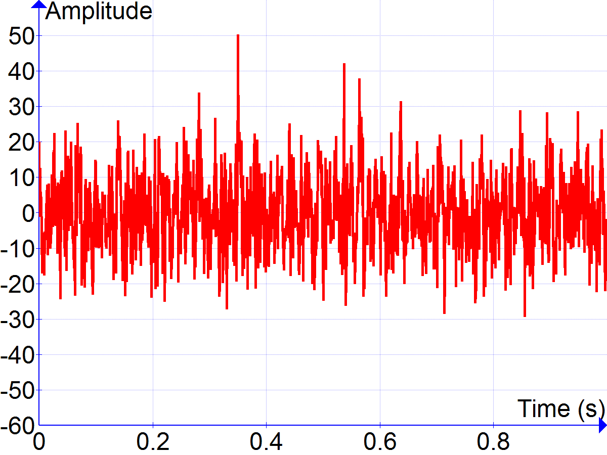
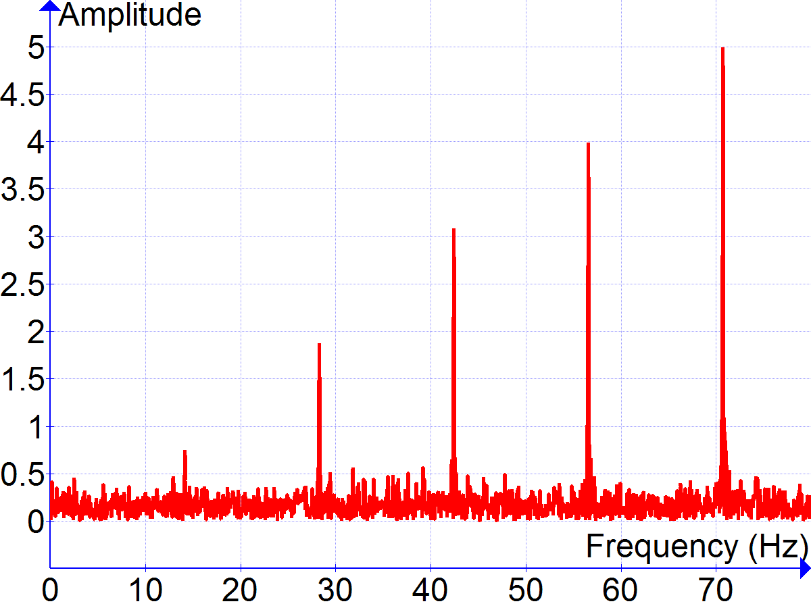

# Plan B

## 源起

### 时域卷积去噪几乎不影响最终结果

去噪并非目的，只是理解信号的手段。

本项目希望评估板材质量，方法是测量前后面回波衰减程度。

任务书对去噪（noise reduction）的阐释如下[^u]，这一步的目标在时域分为两块，“回波部分”要求尽可能不改变原始信号，“其它部分”则要求尽可能为零。

[^u]:原文未分点，无下划线强调。后同。

> A good filter should yield an output signal that is …
>
> - as <u>similar to the original</u> signal as possible <u>in</u> the two ultrasonic echo intervals (with minimum amplitude distortion)  …
> - and as <u>near to zero</u> as possible <u>outside</u> the two ultrasonic echo intervals.

在后续步骤（attenuation estimation）中，又规定了如下处理方法。

> … extraction of the two <u>peak values</u> from the front wall and back wall echoes in each ultrasonic signal …

这意味着，**<u>最终判决结果只取决于“回波部分”</u>**（的时域峰值），**根本不涉及“其它部分”**。换句话说，即使不计算“其它部分”的时域，也能做出完全一样的判决。

因此，前面列的第二点目标其实没有用，完全不必管“其它部分”处理成什么样，只要追求第一点，让“回波部分”保持原貌即可。那么，什么滤波器最能保持信号原貌呢？Dirac δ！也就是不滤波……

——这样说当然太绝对了：回波部分也存在噪声，时域卷积可以抑制这部分噪声。“回波部分”希望贴近原始“<u>信号</u>”，并不直接希望贴近原始“<u>数据</u>”；只是本项目信噪比本来就高，二者很接近罢了。

总之，时域卷积去噪的必要性至少需打个问号，与其它路线比较比较再做决定。

### 时域还是频域？

#### 一般场景

本项目属于“事后”分析，不追求实时性，运算复杂度不用优先考虑。以下重点关注方法的有效性。

<figure>
    
    <figcaption>在一般场景中，信号、噪声在时域混成一团，难以分辨｜<a href='https://commons.wikimedia.org/wiki/File:Cosine_Series_Plus_Noise.png'>Wikimedia Commons</a></figcaption>
</figure>

如上图，在一般信号处理场景（如通信），信号、噪声都一直持续，在时域混成一团，难以分辨。

<figure>
    
    <figcaption>在一般场景中，噪声在频域仍然分散，但信号相对集中，十分明显｜<a href='https://commons.wikimedia.org/wiki/File:Cosine_Series_Plus_Noise_TFM.png'>Wikimedia Commons</a></figcaption>
</figure>

在频域就不一样了。噪声一般是白噪声，分散在各个频率上；而信号集中在几个频率段附近，十分明显。二者虽也略微重叠，但不像时域那样完全混乱了。

滤波器时域卷积，频域相乘。它在频域保留信号的频率段，抛弃其它频率，从而挑出信号。

注意在信号、噪声在频域重叠部分，信号没被抑制，噪声也没被抑制。然而这部分信号占信号的绝大多数，这部分噪声却只占噪声的一小部分。两相比较，信号、噪声的能量比大为提高，剩下那点~儿~噪声就可忽略不计了。

简而言之，一般场景下**<u>信号在时域分散、频域集中</u>**，而噪声在时域、频域都分散，故时域卷积（频域相乘）滤波器能有效分离出信号。

#### 本场景

本场景并非如此。

之所以用超声波探伤，在物理上是因为它有如下特点。（与声波、次声波等更低频的机械波相比）

|  物理特点  |                         对探伤的价值                         |
| :--------: | :----------------------------------------------------------: |
|   波长短   |                         空间分辨率高                         |
| 能流密度高 | 短时间就有足够能量体现缺陷 ⇒ 时间分辨率高，能分出前、后面的回波 |
|   周期短   |                              —                               |

于是，这里信号的时域、频域特点就和一般不同，简直快反过来了。噪声特点同前。如下图。

<figure>
    

        
        
    

    <figcaption>一般场景中，时域、频域情况｜出处同前</figcaption>
</figure>

<figure>
    

        
        
    

    <figcaption>本场景中，时域、频域情况</figcaption>
</figure>

定量地看本场景，**<u>信号在两域集中程度相近，时域略胜一筹</u>**。甚至时域是实打实的宽度，频域只是第一谱零点带宽。

|       域 | 信号宽度 | 噪声宽度 | 重叠比例 |
| -------: | :------: | :------: | :------: |
| **时域** | ~0.3 μs  |  ~9 μs   |    3%    |
| **频域** |  ~5 MHz  | 100 MHz  |    5%    |

> 为简洁，上表措辞含糊，一一解释如下。
>
> - 信号宽度
>
>   - 时域：每一次回波的持续时间。
>   - 频域：回波频谱的第一谱零点带宽。
>
> - 噪声宽度：
>
>   - 时域：噪声持续时间，也就是数据记录时间。
>   - 频域：噪声频谱本无限，然因时域离散采样，混叠成了 0–100 MHz。
>
> - 重叠比例：信号、噪声宽度之比。
>
>   因为无论哪个域，噪声宽度都是满的，二者重叠范围就是信号范围。
>
>   重叠比例与信号集中程度负相关。
>
> 此表只考虑了集中程度，未考虑能量——由 Parseval 定理，无论在哪域能量都不变。比较不同信号时才需考虑能量。

这样看来，一般滤波器是到频域相乘，反而是把信号、噪声搅一搅再处理，无甚好处；不如直接在时域处理。